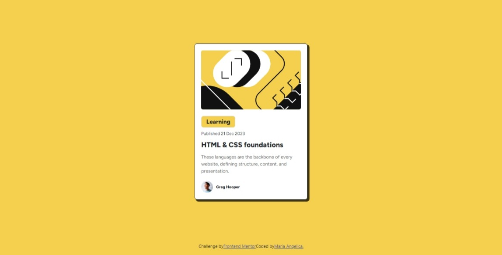

# Frontend Mentor - Blog preview card solution

This is a solution to the [Blog preview card challenge on Frontend Mentor](https://www.frontendmentor.io/challenges/blog-preview-card-ckPaj01IcS). Frontend Mentor challenges help you improve your coding skills by building realistic projects. 

## Table of contents

- [Overview](#overview)
  - [The challenge](#the-challenge)
  - [Screenshot](#screenshot)
  - [Links](#links)
- [My process](#my-process)
  - [Built with](#built-with)
  - [What I learned](#what-i-learned)
  - [Continued development](#continued-development)
  - [Useful resources](#useful-resources)
- [Author](#author)
- [Acknowledgments](#acknowledgments)

## Overview

### The challenge
Crear una tarjeta de vista previa de un blog, siguiendo el desafío propuesto por Frontend Mentor. La tarjeta debe incluir una imagen, título, categoría, fecha de publicación, una breve descripción del artículo y el nombre del autor. Debe ser visualmente atractiva y funcional en diferentes tamaños de pantalla, utilizando HTML, CSS y Bootstrap.

### Screenshot
Este código crea una tarjeta que muestra los detalles de un artículo de blog. 

### Links
- Solution URL: [Github](https://github.com/Mpadilla15/Practica/blob/main/HTML/Blog-preview-card/index.html)
- Live Site URL: [Add live site URL here](https://mpadilla16.github.io/Practica/HTML/Blog-preview-card/index.html)

## My process

### Built with
-HTML5
-CSS (para los estilos personalizados)
-Bootstrap 5.3 (para la maquetación y diseño responsivo)

### What I learned
A través de este desafío, aprendí a implementar un diseño simple pero funcional usando Bootstrap, a manejar el uso de imágenes y enlaces dentro de tarjetas, y cómo adaptar la estructura para que sea responsiva en dispositivos móviles y de escritorio.

### Continued development
En el futuro, puedo seguir trabajando en la personalización de las tarjetas, agregando efectos visuales como transiciones al pasar el ratón, o mejorando la accesibilidad utilizando atributos adicionales como alt en las imágenes y roles adecuados.

### Useful resources

Bootstrap Documentation https://getbootstrap.com/
Frontend Mentor Challenges https://www.frontendmentor.io/challenges/blog-preview-card-ckPaj01IcS 
 
## Author
Maria Angélica padilla: Este proyecto fue desarrollado por María Angélica Ádilla como parte de su proceso de aprendizaje en desarrollo frontend.
- Frontend Mentor - [@Mpadilla16](https://www.frontendmentor.io/profile/Mpadilla15https://www.frontendmentor.io/profile/Mpadilla16)

## Acknowledgments
Agradezco a Frontend Mentor por ofrecer desafíos prácticos que me permiten mejorar mis habilidades como desarrolladora web, y a la comunidad que brinda apoyo y retroalimentación en el proceso de desarrollo.
