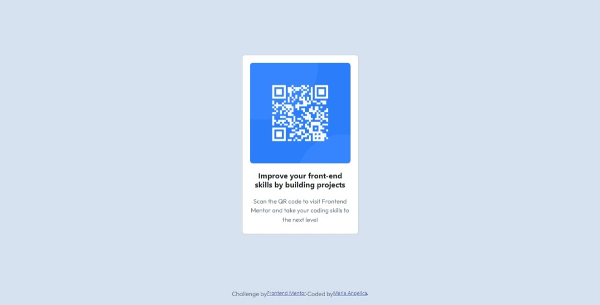

# Frontend Mentor - QR code component solution

This is a solution to the [QR code component challenge on Frontend Mentor](https://www.frontendmentor.io/challenges/qr-code-component-iux_sIO_H). Frontend Mentor challenges help you improve your coding skills by building realistic projects. 

## Table of contents

- [Overview](#overview)
  - [Screenshot](#screenshot)
  - [Links](#links)
- [My process](#my-process)
  - [Built with](#built-with)
  - [What I learned](#what-i-learned)
  - [Continued development](#continued-development)
  - [Useful resources](#useful-resources)
- [Author](#author)
- [Acknowledgments](#acknowledgments)

## Overview

### Screenshot
Aquí presento la captura de pantalla del componente QR desarrollado como parte del desafío de Frontend Mentor. Este proyecto me permitió mejorar mis habilidades en HTML, CSS y Bootstrap, enfocándome en un diseño responsivo y limpio.

### Links
- Solution URL: [Github](https://github.com/Mpadilla16/Practica/blob/main/HTML/Qr-code-component-main/index.html)
- Live Site URL: [Github](https://mpadilla16.github.io/Practica/HTML/Qr-code-component-main/index.html)

## My process

### Built with
Este proyecto fue construido utilizando:

HTML5 semántico.
CSS personalizado.
Bootstrap 5.3 para facilitar el diseño responsivo y modular.
Un enfoque "mobile-first" para garantizar que el diseño se vea bien en dispositivos móviles antes de ajustarse a pantallas más grandes.

### What I learned
Con este desafío, aprendí a trabajar con las clases de Bootstrap para centrar elementos de manera eficiente. Me familiaricé con el uso de d-flex, justify-content-center y align-items-center para alinear elementos tanto horizontal como verticalmente. También entendí cómo estructurar una tarjeta utilizando las clases card y aplicar estilos personalizados.

### Continued development

Experimentar con animaciones CSS para darle vida a los elementos (e.g., hover effects en el texto o la imagen QR).

### Useful resources

Documentación oficial de Bootstrap 5
Guía de Frontend Mentor
CSS Tricks: Guía de Flexbox

## Author
Soy María Angélica Padilla, una apasionada por el desarrollo frontend en constante aprendizaje. Puedes encontrarme en:Frontend Mentor:  https://www.frontendmentor.io/profile/Mpadilla16

## Acknowledgments
Quiero agradecer a Frontend Mentor por crear desafíos tan interesantes que me ayudan a mejorar mis habilidades. También agradezco a los creadores de los recursos mencionados anteriormente, que fueron fundamentales para completar este proyecto.