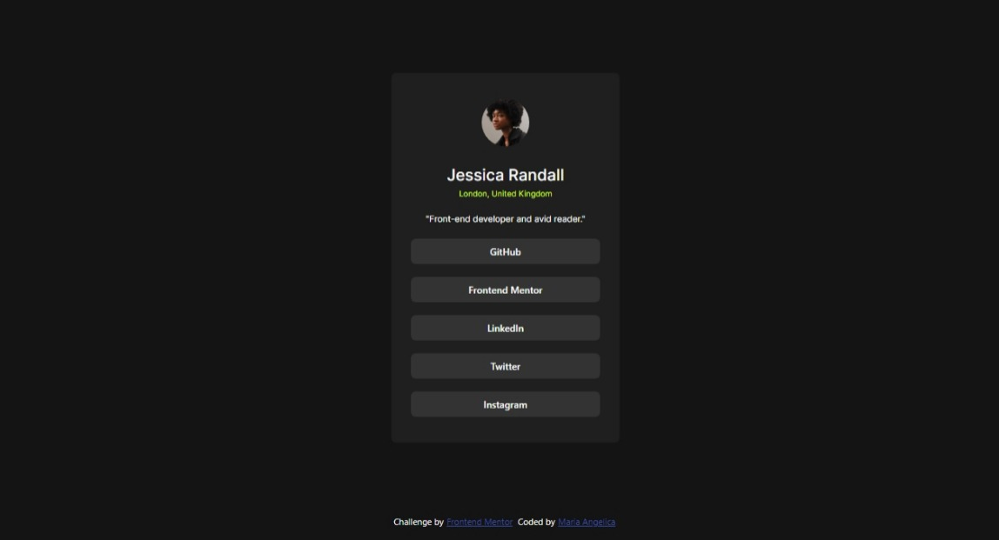

# Frontend Mentor - Social links profile solution

This is a solution to the [Social links profile challenge on Frontend Mentor](https://www.frontendmentor.io/challenges/social-links-profile-UG32l9m6dQ). Frontend Mentor challenges help you improve your coding skills by building realistic projects. 

## Table of contents

- [Overview](#overview)
  - [The challenge](#the-challenge)
  - [Screenshot](#screenshot)
  - [Links](#links)
- [My process](#my-process)
  - [Built with](#built-with)
  - [What I learned](#what-i-learned)
  - [Continued development](#continued-development)
  - [Useful resources](#useful-resources)
- [Author](#author)
- [Acknowledgments](#acknowledgments)

## Overview

### The challenge

El desafío consistió en crear una tarjeta de perfil con enlaces a redes sociales, basándome en un diseño provisto por Frontend Mentor. La meta era lograr un diseño responsivo y visualmente atractivo utilizando HTML, CSS, y Bootstrap.

### Screenshot
Este es el resultado final del proyecto de tarjeta de perfil con enlaces sociales.

### Links

- Solucion URL: [Solucion URL](https://github.com/Mpadilla16/Practica/blob/main/HTML/Qr-code-component-main/index.html)
- Live Site URL: [Sitio en vivo](https://mpadilla16.github.io/Practica/HTML/Social-links-profile-main/index.html)

## My process

### Built with
HTML5 semántico para la estructura.
CSS personalizado y Bootstrap 5.3 para el diseño.
Diseño responsivo utilizando Flexbox y clases de Bootstrap.
Integración de fuentes y estilos externos.

### What I learned
Trabajando en este proyecto, aprendí a:

Incorporar Bootstrap para agilizar la creación de diseños responsivos.
Utilizar las clases utilitarias de Flexbox en Bootstrap para centrar elementos de forma vertical y horizontal.
Estilizar botones y enlaces para un diseño uniforme, aplicando colores personalizados.
Implementar imágenes con bordes redondeados para mejorar la estética general.

### Continued development
En proyectos futuros, me gustaría:

Experimentar más con CSS Grid para diseños más complejos.
Implementar JavaScript para añadir funcionalidad interactiva, como un efecto hover más avanzado.
Mejorar la accesibilidad al usar etiquetas ARIA.

### Useful resources
Bootstrap Documentation - Fue clave para entender y aplicar clases como d-flex y vh-100.
Frontend Mentor - Para el diseño base del reto.
CSS-Tricks Flexbox Guide - Excelente recurso para profundizar en Flexbox.

## Author
- Frontend Mentor - [@Mpadilla16](https://www.frontendmentor.io/profile/Mpadilla16)

## Acknowledgments
Quiero agradecer a Frontend Mentor por los retos y a la comunidad de desarrollo web, cuyos recursos y tutoriales han sido invaluables en este proceso.
