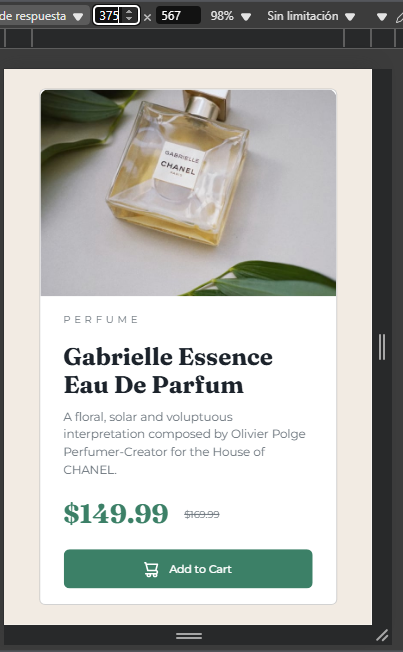
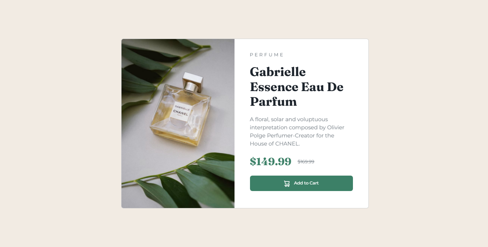

# Frontend Mentor - Product preview card component solution

This is a solution to the [Product preview card component challenge on Frontend Mentor](https://www.frontendmentor.io/challenges/product-preview-card-component-GO7UmttRfa). Frontend Mentor challenges help you improve your coding skills by building realistic projects. 

## Table of contents

- [Overview](#overview)
  - [The challenge](#the-challenge)
  - [Screenshot](#screenshot)
  - [Links](#links)
- [My process](#my-process)
  - [Built with](#built-with)
  - [What I learned](#what-i-learned)
  - [Continued development](#continued-development)
  - [Useful resources](#useful-resources)
- [Author](#author)
- [Acknowledgments](#acknowledgments)

**Note: Delete this note and update the table of contents based on what sections you keep.**

## Overview

### The challenge

Users should be able to:

- View the optimal layout depending on their device's screen size
- See hover and focus states for interactive elements

### Screenshot

### Links

- Solution URL: [Add solution URL here](https://github.com/Mpadilla16/Practica/blob/main/HTML/product-preview-card-component-main/index.html)
- Live Site URL: [Add live site URL here](https://mpadilla16.github.io/Practica/HTML/product-preview-card-component-main/index.html)

## My process

### Built with

HTML5 semántico

Propiedades personalizadas de CSS

Flexbox

Bootstrap 5

Enfoque Mobile-first

SCSS para estilos

### What I learned

En este desafío, practiqué el uso de utilidades de Bootstrap para alinear contenido de manera responsiva. Además, reforcé mi comprensión de SCSS, incluyendo la importación de archivos SCSS de Bootstrap y la personalización de puntos de quiebre. A continuación, un ejemplo de una media query en SCSS que implementé:

@include media-breakpoint-between(lg, xxl) { 
    .card{
        max-width: 40rem;
    }
    .card_article_producto{
        font-size: 12px;
    }
    .card_article_botones_original{
        font-size: 12px;
    }
    .card_article_descripcion{
        font-size: 14px;
    }
}

### Continued development

En futuros proyectos, me gustaría:

Experimentar con componentes más avanzados de Bootstrap

Mejorar la accesibilidad utilizando atributos ARIA

Optimizar imágenes para diferentes resoluciones de pantalla

### Useful resources

Documentación de Bootstrap - Me ayudó a entender las utilidades de Bootstrap.

MDN Web Docs - Gran recurso para buenas prácticas en CSS y HTML.

## Author

- Website - [Add your name here](https://www.your-site.com)
- Frontend Mentor - [@yourusername](https://www.frontendmentor.io/profile/yourusername)

## Acknowledgments

Gracias a Frontend Mentor por proporcionar desafíos excelentes para mejorar mis habilidades en frontend.
