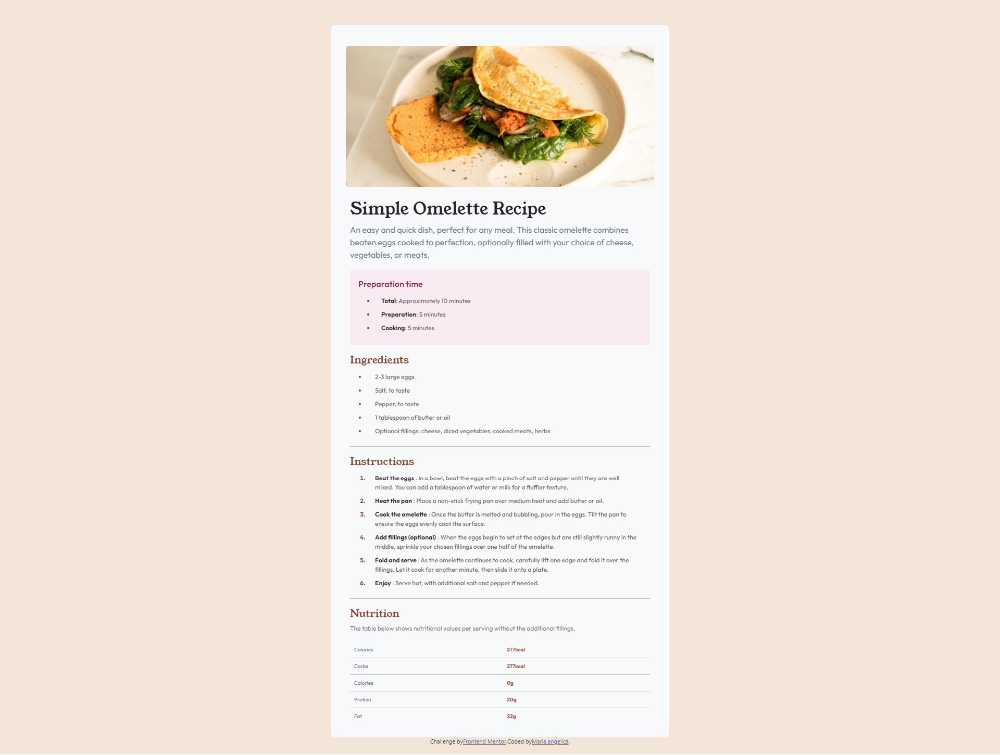
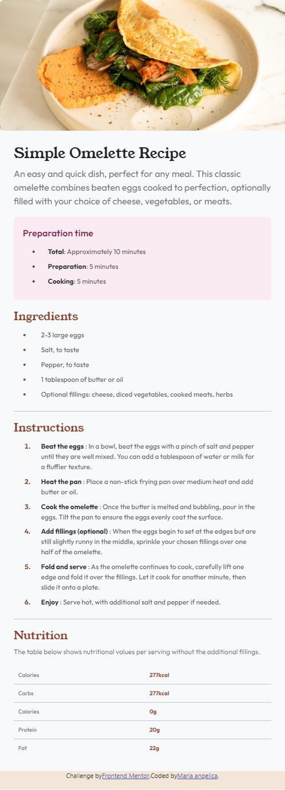

# Frontend Mentor - Recipe page solution

This is a solution to the [Recipe page challenge on Frontend Mentor](https://www.frontendmentor.io/challenges/recipe-page-KiTsR8QQKm). Frontend Mentor challenges help you improve your coding skills by building realistic projects. 

## Table of contents

- [Overview](#overview)
  - [The challenge](#the-challenge)
  - [Screenshot](#screenshot)
  - [Links](#links)
- [My process](#my-process)
  - [Built with](#built-with)
  - [What I learned](#what-i-learned)
  - [Continued development](#continued-development)
  - [Useful resources](#useful-resources)
- [Author](#author)
- [Acknowledgments](#acknowledgments)

## Overview

### The challenge
El desafío consistía en crear una página de recetas que presentara la receta en un formato organizado y visualmente atractivo. El diseño debía resaltar secciones clave como ingredientes, instrucciones, tiempo de preparación y nutrición, todo ello manteniendo la facilidad de uso. El objetivo era presentar la receta en un diseño limpio y responsivo, garantizando que se viera bien en varios dispositivos, incluidos teléfonos móviles y computadoras de escritorio.

### Screenshot
Este es el resultado final del proyecto de la pagina de recetas.

### Links
- Solution URL: [Add solution URL here](https://github.com/Mpadilla16/Practica/blob/main/HTML/recipe-page-main/index.html)
- Live Site URL: [Add live site URL here](https://mpadilla16.github.io/Practica/HTML/recipe-page-main/index.html)

## My process

### Built with
- Semantic HTML5 markup
- CSS custom properties
- Flexbox
- Bootstrap 

### What I learned
En este desafío, aprendi a crear una página web de receta utilizando HTML, CSS y Bootstrap. Implementé una estructura semántica adecuada con etiquetas como <article>, <section>, <ul>y <ol>, lo que mejoró la accesibilidad y organización del contenido. Utilicé Bootstrap para diseñar de manera responsable, asegurando que la página se adaptará a diferentes tamaños de pantalla. Además, integra imágenes, tablas y listas personalizadas para presentar la información de manera clara y atractiva. También aprendi a usar fuentes externas, como las hojas de estilo y scripts de Bootstrap, lo que facilitó el diseño y la funcionalidad sin tener que escribir todo el código desde cero. nbnbn 

### Continued development
Deseo seguir aprendiendo ya que me cuesta mucho las caracteristicas responsivas de las paginas

### Useful resources
- [Bootstrap](https://getbootstrap.com/) 

## Author
- Frontend Mentor - [@Mpadilla16](https://www.frontendmentor.io/profile/Mpadilla16)

